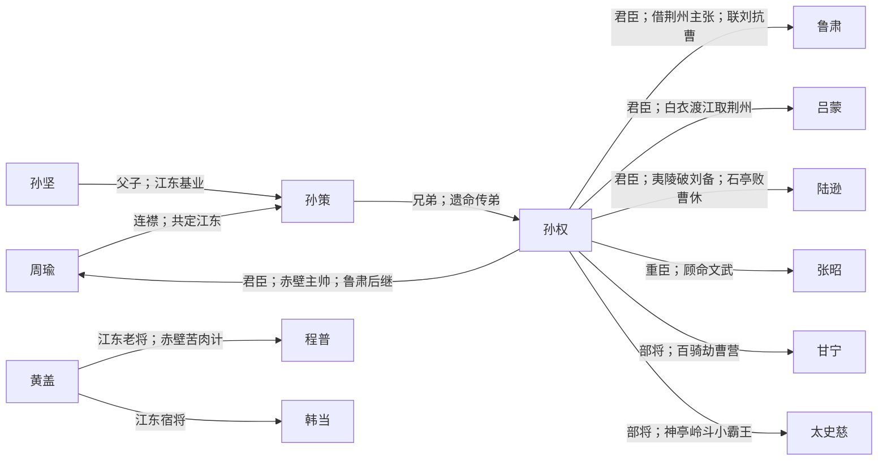

# 东吴 · 人物关系

孙氏据江东，赤壁后与魏蜀成鼎立。

概念词条：[[东吴]]

## 阵营成员

- [[孙坚]]
- [[孙策]]
- [[孙权]]
- [[周瑜]]
- [[鲁肃]]
- [[吕蒙]]
- [[陆逊]]
- [[黄盖]]
- [[程普]]
- [[韩当]]
- [[甘宁]]
- [[太史慈]]
- [[张昭]]
- [[孙尚香]]

## 阵营内关系图

## 阵营内关系（双向链接）

- [[孙坚]] ↔ [[孙策]]：**父子；江东基业**
- [[孙策]] ↔ [[孙权]]：**兄弟；遗命传弟**
- [[孙权]] ↔ [[周瑜]]：**君臣；赤壁主帅；鲁肃后继**
- [[孙权]] ↔ [[鲁肃]]：**君臣；借荆州主张；联刘抗曹**
- [[孙权]] ↔ [[吕蒙]]：**君臣；白衣渡江取荆州**
- [[孙权]] ↔ [[陆逊]]：**君臣；夷陵破刘备；石亭败曹休**
- [[孙权]] ↔ [[张昭]]：**重臣；顾命文武**
- [[孙权]] ↔ [[甘宁]]：**部将；百骑劫曹营**
- [[孙权]] ↔ [[太史慈]]：**部将；神亭岭斗小霸王**
- [[周瑜]] ↔ [[孙策]]：**连襟；共定江东**
- [[黄盖]] ↔ [[程普]]：**江东老将；赤壁苦肉计**
- [[黄盖]] ↔ [[韩当]]：**江东宿将**

## 对外关系

- [[刘备]] ↔ [[孙权]]：**赤壁联盟；借荆州；联姻孙夫人；夷陵之战**
- [[关羽]] ↔ [[孙权]]：**荆州归属；吕蒙袭荆州；败走麦城**
- [[诸葛亮]] ↔ [[周瑜]]：**赤壁合作；荆州之争；既生瑜何生亮**
- [[周瑜]] ↔ [[曹操]]：**赤壁火攻；南郡争夺**
- [[孙权]] ↔ [[曹操]]：**赤壁对立；濡须口；石亭之战**
- [[张辽]] ↔ [[孙权]]：**逍遥津八百破十萬**
- [[甘宁]] ↔ [[曹操]]：**百骑劫营**
- [[孙尚香]] ↔ [[刘备]]：**政治联姻；归吴**
- [[陆逊]] ↔ [[刘备]]：**夷陵火烧连营**

## 说明

由 `build_faction_graph.py` 根据 `character_relations.py` 生成。
在 Obsidian 关系图中以本阵营成员为簇，沿链接线查看标注事件。
