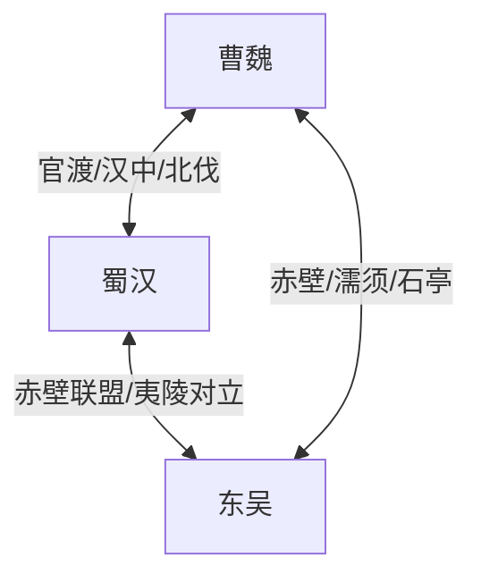
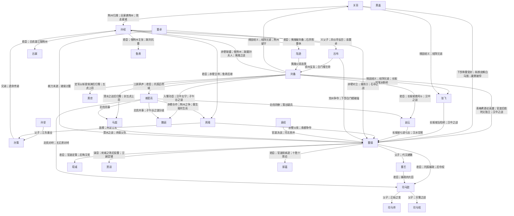

# 人物关系图谱 · 阵营总览

以**阵营**为簇组织人物，人物之间为**双向链接**；连线上文字见各阵营页或人物页的表格/Mermaid。

## 交互关系图（浏览器打开）

**[人物关系图.html](./人物关系图.html)** — 63 人、81 条关系；节点按阵营着色，**连线上直接标注事件/缘由**；顶部可筛选蜀汉/曹魏/东吴/群雄；可拖拽缩放。

重新生成：`python3 build_relationship_graph.py`

| 阵营 | 说明 | 关系页 |
| --- | --- | --- |
| 蜀汉 | 刘备集团，据益州、汉中，以兴复汉室为号。… | [[蜀汉]] |
| 曹魏 | 曹操奠基，曹丕代汉，后期司马氏专权。… | [[曹魏]] |
| 东吴 | 孙氏据江东，赤壁后与魏蜀成鼎立。… | [[东吴]] |
| 群雄 | 汉末割据与前期势力，后多被魏蜀吴吞并。… | [[群雄]] |

## 三国鼎立关系示意

## 全图（核心人物）

## 使用说明

1. 打开阵营页（如 [[蜀汉]]）查看本阵营内/对外全部标注关系。
2. 打开人物页「阵营与人物关系」表，查看与该人物相关的双向链接。
3. 重新生成：`python3 build_faction_graph.py`。
