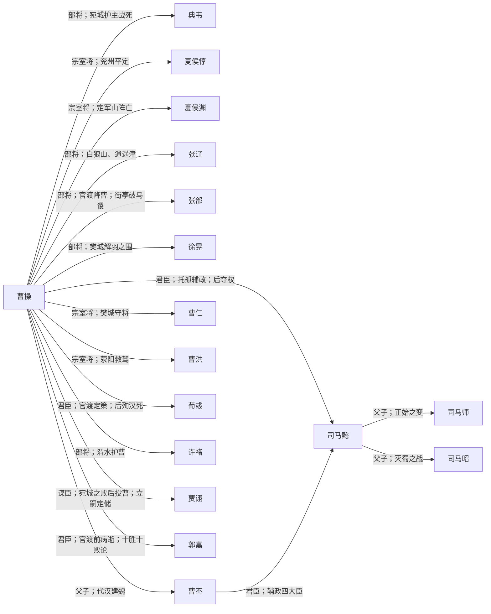

# 曹魏 · 人物关系

曹操奠基，曹丕代汉，后期司马氏专权。

概念词条：[[曹魏]]

## 阵营成员

- [[曹操]]
- [[曹丕]]
- [[司马懿]]
- [[司马师]]
- [[司马昭]]
- [[荀彧]]
- [[郭嘉]]
- [[贾诩]]
- [[典韦]]
- [[许褚]]
- [[张辽]]
- [[徐晃]]
- [[张郃]]
- [[曹仁]]
- [[曹洪]]
- [[夏侯惇]]
- [[夏侯渊]]

## 阵营内关系图

## 阵营内关系（双向链接）

- [[曹操]] ↔ [[曹丕]]：**父子；代汉建魏**
- [[曹操]] ↔ [[司马懿]]：**君臣；托孤辅政；后夺权**
- [[曹操]] ↔ [[荀彧]]：**君臣；官渡定策；后殉汉死**
- [[曹操]] ↔ [[郭嘉]]：**君臣；官渡前病逝；十胜十败论**
- [[曹操]] ↔ [[贾诩]]：**谋臣；宛城之败后投曹；立嗣定储**
- [[曹操]] ↔ [[典韦]]：**部将；宛城护主战死**
- [[曹操]] ↔ [[许褚]]：**部将；渭水护曹**
- [[曹操]] ↔ [[张辽]]：**部将；白狼山、逍遥津**
- [[曹操]] ↔ [[徐晃]]：**部将；樊城解羽之围**
- [[曹操]] ↔ [[张郃]]：**部将；官渡降曹；街亭破马谡**
- [[曹操]] ↔ [[曹仁]]：**宗室将；樊城守将**
- [[曹操]] ↔ [[曹洪]]：**宗室将；荥阳救驾**
- [[曹操]] ↔ [[夏侯惇]]：**宗室将；兖州平定**
- [[曹操]] ↔ [[夏侯渊]]：**宗室将；定军山阵亡**
- [[司马懿]] ↔ [[司马师]]：**父子；正始之变**
- [[司马懿]] ↔ [[司马昭]]：**父子；灭蜀之战**
- [[曹丕]] ↔ [[司马懿]]：**君臣；辅政四大臣**

## 对外关系

- [[刘备]] ↔ [[曹操]]：**青梅煮酒论英雄；官渡后依附又独立；汉中之战**
- [[关羽]] ↔ [[曹操]]：**下邳降曹受封；斩颜良解白马围；襄樊被俘**
- [[张飞]] ↔ [[曹操]]：**长坂坡当阳桥；汉中之战**
- [[诸葛亮]] ↔ [[司马懿]]：**北伐对峙；五丈原对峙**
- [[赵云]] ↔ [[曹操]]：**长坂坡七进七出；汉水空营**
- [[周瑜]] ↔ [[曹操]]：**赤壁火攻；南郡争夺**
- [[孙权]] ↔ [[曹操]]：**赤壁对立；濡须口；石亭之战**
- [[吕布]] ↔ [[曹操]]：**兖州争夺；下邳白门楼被缢**
- [[袁绍]] ↔ [[曹操]]：**官渡决战；河北吞并**
- [[马超]] ↔ [[曹操]]：**渭水之战；杀操父仇**
- [[张辽]] ↔ [[孙权]]：**逍遥津八百破十萬**
- [[甘宁]] ↔ [[曹操]]：**百骑劫营**
- [[董卓]] ↔ [[曹操]]：**献刀未遂；诸侯讨董**

## 说明

由 `build_faction_graph.py` 根据 `character_relations.py` 生成。
在 Obsidian 关系图中以本阵营成员为簇，沿链接线查看标注事件。
