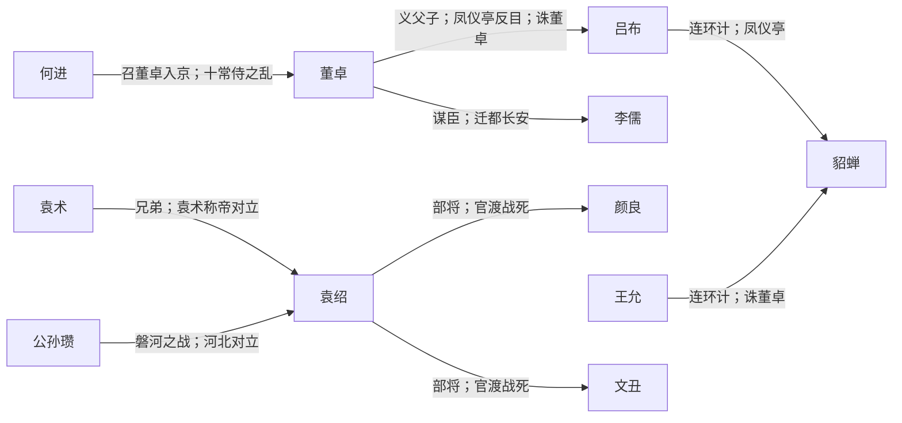

# 群雄 · 人物关系

汉末割据与前期势力，后多被魏蜀吴吞并。

## 阵营成员

- [[董卓]]
- [[吕布]]
- [[貂蝉]]
- [[李儒]]
- [[王允]]
- [[袁绍]]
- [[袁术]]
- [[公孙瓒]]
- [[刘表]]
- [[刘璋]]
- [[张角]]
- [[何进]]
- [[华雄]]
- [[颜良]]
- [[文丑]]

## 阵营内关系图

## 阵营内关系（双向链接）

- [[董卓]] ↔ [[吕布]]：**义父子；凤仪亭反目；诛董卓**
- [[董卓]] ↔ [[李儒]]：**谋臣；迁都长安**
- [[王允]] ↔ [[貂蝉]]：**连环计；诛董卓**
- [[吕布]] ↔ [[貂蝉]]：**连环计；凤仪亭**
- [[袁绍]] ↔ [[颜良]]：**部将；官渡战死**
- [[袁绍]] ↔ [[文丑]]：**部将；官渡战死**
- [[袁术]] ↔ [[袁绍]]：**兄弟；袁术称帝对立**
- [[公孙瓒]] ↔ [[袁绍]]：**磐河之战；河北对立**
- [[何进]] ↔ [[董卓]]：**召董卓入京；十常侍之乱**

## 对外关系

- [[吕布]] ↔ [[曹操]]：**兖州争夺；下邳白门楼被缢**
- [[吕布]] ↔ [[刘备]]：**徐州反复；白门楼乞命**
- [[袁绍]] ↔ [[曹操]]：**官渡决战；河北吞并**
- [[董卓]] ↔ [[曹操]]：**献刀未遂；诸侯讨董**
- [[刘表]] ↔ [[刘备]]：**荆州依附；托孤刘琦**
- [[刘璋]] ↔ [[刘备]]：**同宗；入川夺益州**
- [[公孙瓒]] ↔ [[刘备]]：**同窗；早年支援**
- [[张角]] ↔ [[刘备]]：**黄巾之乱初战；讨贼立功**

## 说明

由 `build_faction_graph.py` 根据 `character_relations.py` 生成。
在 Obsidian 关系图中以本阵营成员为簇，沿链接线查看标注事件。
