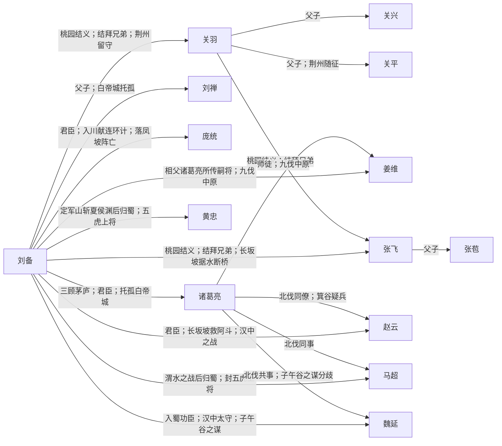

# 蜀汉 · 人物关系

刘备集团，据益州、汉中，以兴复汉室为号。

概念词条：[[蜀汉]]

## 阵营成员

- [[刘备]]
- [[关羽]]
- [[张飞]]
- [[诸葛亮]]
- [[赵云]]
- [[马超]]
- [[黄忠]]
- [[魏延]]
- [[庞统]]
- [[姜维]]
- [[刘禅]]
- [[关平]]
- [[关兴]]
- [[张苞]]
- [[马岱]]

## 交互关系图（推荐）

在浏览器中打开：**[人物关系图.html](./人物关系图.html)**（可筛选「蜀汉」），节点可拖拽，连线标注事件。

## 阵营内关系图

## 阵营内关系（双向链接）

- [[刘备]] ↔ [[关羽]]：**桃园结义；结拜兄弟；荆州留守**
- [[刘备]] ↔ [[张飞]]：**桃园结义；结拜兄弟；长坂坡据水断桥**
- [[关羽]] ↔ [[张飞]]：**桃园结义；结拜兄弟**
- [[刘备]] ↔ [[诸葛亮]]：**三顾茅庐；君臣；托孤白帝城**
- [[刘备]] ↔ [[赵云]]：**君臣；长坂坡救阿斗；汉中之战**
- [[刘备]] ↔ [[马超]]：**渭水之战后归蜀；封五虎上将**
- [[刘备]] ↔ [[黄忠]]：**定军山斩夏侯渊后归蜀；五虎上将**
- [[刘备]] ↔ [[魏延]]：**入蜀功臣；汉中太守；子午谷之谋**
- [[刘备]] ↔ [[庞统]]：**君臣；入川献连环计；落凤坡阵亡**
- [[刘备]] ↔ [[姜维]]：**相父诸葛亮所传嗣将；九伐中原**
- [[刘备]] ↔ [[刘禅]]：**父子；白帝城托孤**
- [[诸葛亮]] ↔ [[赵云]]：**北伐同僚；箕谷疑兵**
- [[诸葛亮]] ↔ [[姜维]]：**师徒；九伐中原**
- [[诸葛亮]] ↔ [[魏延]]：**北伐共事；子午谷之谋分歧**
- [[诸葛亮]] ↔ [[马超]]：**北伐同事**
- [[关羽]] ↔ [[关平]]：**父子；荆州随征**
- [[关羽]] ↔ [[关兴]]：**父子**
- [[张飞]] ↔ [[张苞]]：**父子**

## 对外关系

- [[刘备]] ↔ [[曹操]]：**青梅煮酒论英雄；官渡后依附又独立；汉中之战**
- [[刘备]] ↔ [[孙权]]：**赤壁联盟；借荆州；联姻孙夫人；夷陵之战**
- [[关羽]] ↔ [[曹操]]：**下邳降曹受封；斩颜良解白马围；襄樊被俘**
- [[关羽]] ↔ [[孙权]]：**荆州归属；吕蒙袭荆州；败走麦城**
- [[张飞]] ↔ [[曹操]]：**长坂坡当阳桥；汉中之战**
- [[诸葛亮]] ↔ [[司马懿]]：**北伐对峙；五丈原对峙**
- [[诸葛亮]] ↔ [[周瑜]]：**赤壁合作；荆州之争；既生瑜何生亮**
- [[赵云]] ↔ [[曹操]]：**长坂坡七进七出；汉水空营**
- [[吕布]] ↔ [[刘备]]：**徐州反复；白门楼乞命**
- [[马超]] ↔ [[曹操]]：**渭水之战；杀操父仇**
- [[刘表]] ↔ [[刘备]]：**荆州依附；托孤刘琦**
- [[刘璋]] ↔ [[刘备]]：**同宗；入川夺益州**
- [[公孙瓒]] ↔ [[刘备]]：**同窗；早年支援**
- [[张角]] ↔ [[刘备]]：**黄巾之乱初战；讨贼立功**
- [[孙尚香]] ↔ [[刘备]]：**政治联姻；归吴**
- [[陆逊]] ↔ [[刘备]]：**夷陵火烧连营**
- [[邓艾]] ↔ [[姜维]]：**沓中屯田；剑阁灭蜀**
- [[钟会]] ↔ [[姜维]]：**伐蜀联军；成都之乱**

## 说明

由 `build_faction_graph.py` 根据 `character_relations.py` 生成。
在 Obsidian 关系图中以本阵营成员为簇，沿链接线查看标注事件。
