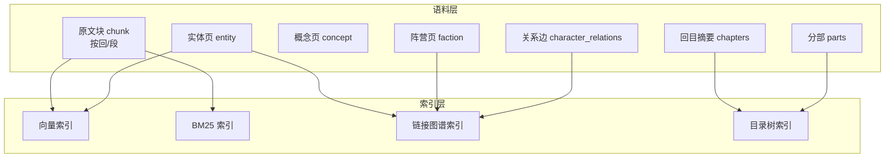
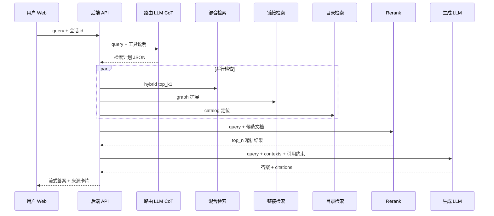
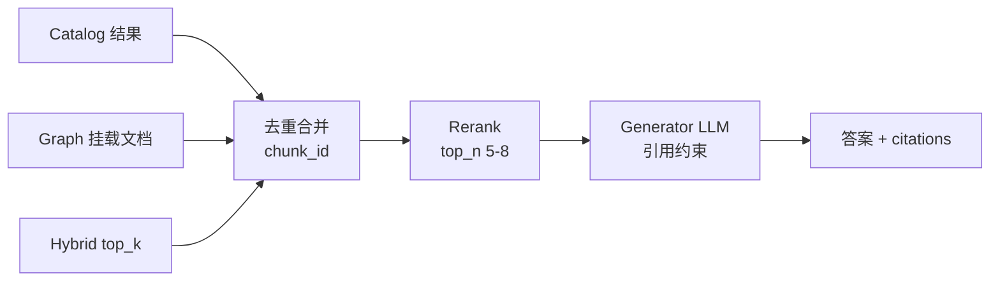

# 《三国演义》知识智能问答系统 — 架构设计（仅设计）

基于你当前仓库中的知识资产（链化原文、实体/概念词条、回目索引、阵营关系、人物关系图），设计一套**多路检索 + CoT 路由 + Rerank + 生成**的问答系统，并配套 Web 前端。

---

## 1. 目标与边界

| 项目 | 说明 |
|------|------|
| **目标** | 用户用自然语言提问，系统返回有据可查的答案，并展示引用来源 |
| **知识范围** | `source/three_kingdoms.txt`（链化原文）+ `wiki/index` + `wiki/entity` + `wiki/concept` + `wiki/faction` + `character_relations.py` 结构化关系 |
| **非目标（首期）** | 不做通用搜索引擎；不保证覆盖全书外史料（代码已实现 MVP，见 `04-实现对照.md`） |

---

## 2. 现有知识资产 → 检索语料映射



| 语料类型 | 路径 | 典型用途 |
|----------|------|----------|
| **原文块** | `source/three_kingdoms.txt` | 情节、对话、细节考证 |
| **回目摘要** | `wiki/index/chapters/第N回.md` | 「第几回发生什么」 |
| **分部梗概** | `wiki/index/parts/` | 宏观阶段、时间线 |
| **总目录** | `wiki/index/index.md` | 导航、范围确认 |
| **实体词条** | `wiki/entity/entity/*.md` | 人物/地点/器物属性与共现 |
| **概念词条** | `wiki/concept/concept/*.md` | 势力、事件、组织 |
| **阵营关系** | `wiki/faction/*.md` + 关系数据 | 阵营、人物关系、事件缘由 |
| **结构化边** | `character_relations.RELATION_EDGES` | 关系问答、因果链 |

**建库建议（离线一次性）**

- 原文：按「回」或「回 + 固定字数重叠块（如 400–600 字）」切分；块元数据含：`chapter_id`、`title`、`char_offset`、文中 `[[实体]]` 列表。
- 词条/摘要：一页一块，metadata 含 `doc_type`（entity / concept / chapter / faction / part）。

---

## 3. 系统总体架构



---

## 4. 三路检索设计

### 4.1 目录检索（Catalog Retrieval）

**适用问题**：第几回、哪一部、全书结构、某事件大概在什么阶段。

| 项 | 设计 |
|----|------|
| **索引对象** | `wiki/index/index.md`、`parts/*.md`、`chapters/*.md` 的标题 + 摘要字段 |
| **检索方式** | 轻量 BM25 或关键词匹配 + 回次编号解析（「第七回」→ `第七回.md`） |
| **输出** | 1–5 条「目录级」文档 + 可选展开：指向对应回目的原文块 id 列表 |
| **特点** | 延迟低、可解释；不替代原文细节 |

**Query 信号（路由用）**：含「第几回」「哪一章」「全书」「先后」「第几部」「概览」「目录」等。

---

### 4.2 实体双向链接检索（Graph / Link Retrieval）

**适用问题**：人物关系、阵营、某两人为何对立/结盟、与某事件相关的人物网。

| 项 | 设计 |
|----|------|
| **图谱来源** | ① 词条内 `[[刘备]]` 等 wikilink；② `阵营与人物关系` 表；③ `character_relations.RELATION_EDGES` |
| **入口** | 从 query 中 NER/别名表识别实体（复用 `ALIASES`） |
| **扩展策略** | 1-hop / 2-hop 邻接；边上带 `tags`（事件标注）；可按阵营过滤 |
| **挂载语料** | 每个命中实体 → 拉取 entity 页 + 关系表 + 可选「含该实体的原文块」 |
| **输出** | 结构化片段（关系三元组）+ 关联 markdown 文档 id |

**Query 信号**：含人名、「关系」「为何」「阵营」「蜀汉/曹魏」「结义」「赤壁」等关系型问法。

---

### 4.3 混合检索（Hybrid = 向量 + BM25）

**适用问题**：开放式情节、台词、因果、地点事件等需原文依据的问题。

| 项 | 设计 |
|----|------|
| **向量检索** | 中文 embedding（如 bge-m3 / text2vec）；索引字段：原文块 + 词条摘要 |
| **BM25** | 同一语料库；中文分词（jieba + 三国专名词典） |
| **融合** | RRF 或加权：`score = α·dense + (1-α)·sparse`，默认 α=0.5，路由可微调 |
| **候选规模** | 路由输出 `top_k`（建议默认 **30–50**，上限 80） |
| **Rerank** | Cross-encoder（如 bge-reranker-v2-m3）对 `(query, doc)` 打分，取 **top_n=5–8** 送入生成 |
| **输出** | 精排后的文本块 + metadata（回目、路径、得分） |

**Query 信号**：叙事型、没有明确结构/关系指向的「发生了什么」「怎么死的」「谁杀了谁」等。

---

## 5. CoT 检索路由（Router）

由 **Router LLM** 在收到 query 后先输出结构化「检索计划」，再执行；不把三路全部跑满（除非 `multi_path=true`）。

### 5.1 输出 Schema（建议 JSON）

```json
{
  "reasoning": "用户问关羽之死，需要回目定位+原文细节，人物关系为辅",
  "paths": [
    {
      "type": "catalog",
      "enabled": true,
      "params": { "target": "chapter", "hints": ["败走麦城", "第七十七回"] }
    },
    {
      "type": "hybrid",
      "enabled": true,
      "params": { "top_k": 40, "alpha": 0.55, "filters": { "entities": ["关羽", "孙权", "吕蒙"] } }
    },
    {
      "type": "graph",
      "enabled": true,
      "params": { "seed_entities": ["关羽", "孙权", "吕蒙"], "hops": 1 }
    }
  ],
  "merge_strategy": "union_rerank",
  "rerank": { "enabled": true, "top_n": 6 },
  "answer_style": "cite_required"
}
```

### 5.2 CoT 提示要点（设计层）

1. **理解意图**：事实 / 关系 / 结构 / 比较 / 多跳  
2. **选路规则（示例）**  
   - 仅结构 → 只开 `catalog`  
   - 仅关系 → 主开 `graph`，hybrid 作补充  
   - 情节细节 → 主开 `hybrid`（必须给 `top_k`）  
   - 复合问题 → 多路并行，`merge_strategy=union_rerank`  
3. **输出约束**：必须 JSON；`top_k` 仅在 `hybrid.enabled=true` 时必填  

### 5.3 候选合并与 Rerank



| 步骤 | 规则 |
|------|------|
| **去重** | 以 `chunk_id` 为键；同块多路命中时保留较高 `score` |
| **Rerank** | Cross-Encoder 或 DashScope Rerank 对 `(query, passage)` 重打分 |
| **截断** | 取 `top_n`（默认 6）块送入生成；单块上下文建议 ≤1200 字 |
| **生成** | System 要求「仅依据检索材料」；文末列出参考编号 |

---

## 6. 答案生成（Generator）

| 项 | 设计 |
|----|------|
| **输入** | `query` + 精排后的 `contexts[]`（含回目、路径、via 标记） |
| **模型** | 对话 LLM（比 Router 更大，如 `qwen-plus`） |
| **输出** | 自然语言答案 + 结构化 `citations[]`（chunk_id、title、source_path、via、score） |
| **约束** | 禁止编造；材料不足时明确说明 |
| **可选** | `stream=True` 流式返回前端 |

---

## 7. 前端 Web 与 API 契约

| API | 方法 | 说明 |
|-----|------|------|
| `/api/chat` | POST | `query` + 可选 `session_id`；返回 `answer`、`citations`、`router` |
| `/api/ingest` | POST | 离线灌库触发（重建 chunks / 向量） |
| `/api/health` | GET | 服务与库文件状态 |
| `/api/chat/stream` | POST | （扩展）SSE 流式答案 |

| 前端模块 | 功能 |
|----------|------|
| 对话区 | 多轮输入、展示助手回复 |
| 来源卡片 | 展示 `citations`：回目、wiki 路径、检索通道（catalog/graph/hybrid） |
| 检索透明 | 展示 Router 的 `reasoning` 与各路开关 |
| 索引管理 | 「重建索引」按钮调用 ingest |

---

## 8. 分阶段实施建议

| 阶段 | 内容 |
|------|------|
| **MVP** | 单库灌库 + Hybrid + Rerank + Generator + 简单 Web |
| **二期** | CoT Router 三路并行 + 会话与 `retrieval_logs` |
| **三期** | LangChain/LangGraph 编排、DashScope Rerank、流式输出、评测集 |

> 说明：仓库中已实现 MVP 代码，见同目录 `04-实现对照.md`。