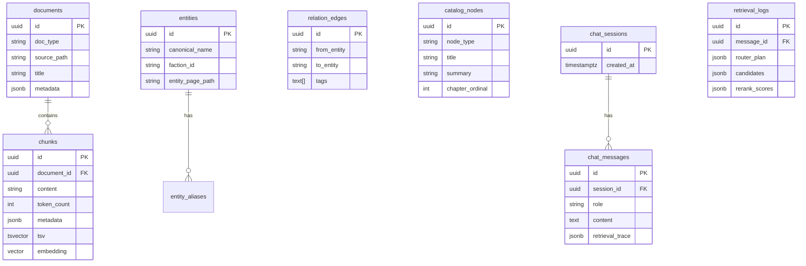
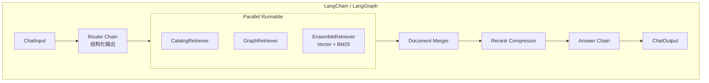
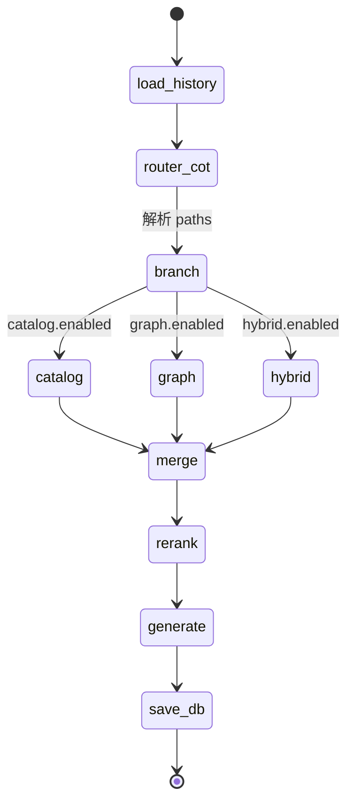

在先前多路检索方案上，补充**持久化数据库**、**LangChain 组件映射**，以及**逐步所需的 LLM 与工具**清单（仍仅设计，不写代码）。

---

# 《三国演义》知识问答系统 — 持久化 + LangChain 实施设计

## 1. 总体技术栈

| 层级 | 选型建议 | 作用 |
|------|----------|------|
| 编排框架 | **LangChain** + **LangGraph**（推荐） | Chain / Agent / 多步路由、可观测 |
| 关系库 | **PostgreSQL**（+ `pgvector`） | 元数据、会话、文档块、向量、可选 BM25 用全文检索 |
| 向量 | **pgvector** 或 **Qdrant**（二选一，下文以 PG 为主） | 永久化 embedding |
| 稀疏检索 | **PostgreSQL `tsvector`** 或 **Elasticsearch/OpenSearch** | BM25 类关键词检索 |
| 图谱 | **PostgreSQL 边表** 或 **Neo4j**（首期 PG 边表即可） | 实体关系、wikilink |
| 缓存 | **Redis**（可选） | 会话热数据、embedding 缓存 |
| 对象存储 | 本地 / **MinIO**（可选） | 原始 md、html 快照 |
| Rerank | **独立 Cross-Encoder API** 或本地 **sentence-transformers** | 非 LLM，专用 rerank 模型 |
| 前端 | **Next.js / Vue** + SSE | 对话 UI |
| API | **FastAPI** | 对接 LangChain 服务 |

**原则**：索引与业务数据**落库可重建**；原文与 wiki 为源，通过离线 `ingest` 任务灌库。

---

## 2. 持久化数据模型（库表/集合）

| 存储对象 | 持久化内容 | 说明 |
|----------|------------|------|
| `documents` | 语料单元（回目页、实体页、原文文件逻辑文档） | 与文件路径一一对应 |
| `chunks` | 可检索文本块 + **embedding** + **tsvector** | 混合检索主表 |
| `entities` / `entity_aliases` | 规范名、别名（来自 `character_relations`） | 链接检索入口 |
| `relation_edges` | 关系边 + 事件标签 | 图谱检索 |
| `wikilinks` | `(chunk_id, entity_id)` 共现 | 从 `[[刘备]]` 解析 |
| `catalog_nodes` | index / parts / chapters 树 | 目录检索 |
| `chat_sessions` / `chat_messages` | 用户对话永久保存 | 多轮上下文 |
| `retrieval_logs` | 每轮 CoT 计划、top_k、rerank 分 | 审计与调试 |

**离线灌库流水线**（一次性/增量）：`source` + `wiki/**` → 解析 → 写 `documents/chunks/entities/...` → 调 embedding API 写向量。

---

## 3. LangChain 架构映射

| LangChain 概念 | 本系统对应 |
|----------------|------------|
| `Document` | 每个 chunk / 词条页 / 关系片段 |
| `VectorStore` | `PGVector` 或 `Qdrant` 包装 `chunks.embedding` |
| `BM25Retriever` | `PG tsvector` 自定义 Retriever 或 `ElasticsearchStore` |
| `EnsembleRetriever` | 向量 + BM25 加权/RRF |
| `ContextualCompressionRetriever` + `CrossEncoderReranker` | Rerank 阶段 |
| `with_structured_output` Router | CoT 检索计划 JSON |
| `LangGraph` StateGraph | Router → 并行检索 → Merge → Rerank → Generate |
| `RunnableLambda` | 写 `retrieval_logs`、加载会话历史 |
| `ChatMessageHistory` | `PostgresChatMessageHistory` 持久化多轮 |

---

## 4. 端到端步骤：每步 LLM / 工具 / 持久化

### 步骤 0：离线建库（非在线问答，但需永久化）

| 子步骤 | 类型 | 模型/工具 | 持久化写入 |
|--------|------|-----------|------------|
| 0.1 扫描语料 | **工具** | Python 脚本、`pathlib`、正则解析 `[[wikilink]]` | — |
| 0.2 分块 | **工具** | 按回/字数切分、`character_relations` 别名表 | `documents`, `chunks` |
| 0.3 目录入库 | **工具** | 解析 `wiki/index/**` | `catalog_nodes` |
| 0.4 实体与关系入库 | **工具** | `character_relations.py` | `entities`, `relation_edges`, `wikilinks` |
| 0.5 向量化 | **Embedding 模型**（非对话 LLM） | 如 `BAAI/bge-m3` API 或本地 | `chunks.embedding` |
| 0.6 稀疏索引 | **工具** | PostgreSQL `to_tsvector('simple', ...)` 或 ES index | `chunks.tsv` 或 ES |

**本步无需对话 LLM**；可选用小模型做 chunk 摘要 enrich（非必须）。

---

### 步骤 1：接收用户问题（Web → API）

| 项 | 说明 |
|----|------|
| **工具** | FastAPI、`PostgresChatMessageHistory` |
| **LLM** | 无 |
| **持久化** | `chat_sessions` 新建/续用；`chat_messages` 写入 `role=user` |

---

### 步骤 2：CoT 检索路由（Router）

| 项 | 说明 |
|----|------|
| **LLM** | **路由专用模型**（偏结构化、低成本） 例：`gpt-4o-mini` / `claude-3-5-haiku` / 国产 `qwen-turbo` |
| **LangChain** | `ChatPromptTemplate` + `with_structured_output(RouterPlan)` 或 `PydanticOutputParser` |
| **工具** | 无外部工具；输入含：query、可选会话摘要、三路能力说明、默认 `top_k` 范围 |
| **输出** | `paths[]`：`catalog` / `graph` / `hybrid` + `top_k`、`alpha`、`seed_entities`、`hops` |
| **持久化** | `retrieval_logs.router_plan`（与 message_id 关联） |

**Router 不负责生成最终答案**，只产出检索计划（CoT 写在 `reasoning` 字段）。

---

### 步骤 3a：目录检索（Catalog Retriever）

| 项 | 说明 |
|----|------|
| **LLM** | **无**（规则 + BM25 即可） |
| **LangChain** | 自定义 `BaseRetriever` → 查 `catalog_nodes` |
| **工具** | SQL / 中文分词；回次正则（「第七十七回」→ ordinal=77） |
| **持久化** | 读 `catalog_nodes`；结果 doc_id 列表记入 `retrieval_logs.candidates` |

---

### 步骤 3b：实体链接检索（Graph Retriever）

| 项 | 说明 |
|----|------|
| **LLM** | **可选小模型**（仅当规则 NER 抽不出实体时） 例：用 Router 同一模型做 `entity_extraction`；**首选规则+别名表，不用 LLM** |
| **LangChain** | 自定义 `GraphRetriever`：种子实体 → SQL 查 `relation_edges` + `wikilinks` → 拉 entity 页与关联 chunk |
| **工具** | `character_relations.ALIASES`、`FACTIONS`；PostgreSQL 邻接查询 |
| **持久化** | 读 `entities`、`relation_edges`、`wikilinks`；输出合并进 candidates |

---

### 步骤 3c：混合检索（Hybrid Retriever）

| 项 | 说明 |
|----|------|
| **LLM** | **无** |
| **LangChain** | `EnsembleRetriever([vector_retriever, bm25_retriever], weights=[α, 1-α])` |
| **工具** | **Embedding**：`bge-m3`（与建库一致） **向量库**：`PGVector` / LangChain `Qdrant` **BM25**：`PostgresFTSRetriever` 或 `ElasticSearchBM25Retriever` |
| **参数** | Router 给出的 **`top_k`**（如 40） |
| **持久化** | 向量/BM25 均查 `chunks`；候选 id+粗分写入 `retrieval_logs` |

---

### 步骤 4：候选合并与去重

| 项 | 说明 |
|----|------|
| **LLM** | 无 |
| **LangChain** | `RunnableLambda(merge_docs)`：按 `chunk_id` 去重；catalog/graph 映射到 chunk |
| **工具** | 内存合并；可选按 `doc_type` 配额（避免全是目录摘要） |
| **持久化** | 更新 `retrieval_logs.candidates` 合并后列表 |

---

### 步骤 5：Rerank 精排

| 项 | 说明 |
|----|------|
| **模型** | **Rerank 专用模型**（非生成 LLM） 例：`BAAI/bge-reranker-v2-m3`、`cohere-rerank` API |
| **LangChain** | `ContextualCompressionRetriever` + `CrossEncoderReranker` 或 `CohereRerank` |
| **工具** | 输入 `(query, document.page_content)`；Router 定 **`top_n`**（如 6） |
| **LLM** | 无 |
| **持久化** | `retrieval_logs.rerank_scores`（doc_id, score） |

---

### 步骤 6：上下文组装与答案生成（Generator）

| 项 | 说明 |
|----|------|
| **LLM** | **主生成模型**（质量优先） 例：`gpt-4o` / `claude-sonnet` / `qwen-max` / `deepseek-chat` |
| **LangChain** | `create_stuff_documents_chain` 或 `ChatPromptTemplate` + `StrOutputParser`；`stream` 输出 |
| **工具** | 无检索工具（检索已完成）；Prompt 注入： • 精排后 Document 列表 • 引用格式要求 • 关系三元组（若 graph 命中） |
| **持久化** | `chat_messages` `role=assistant`；附 `retrieval_trace`（引用 chunk_id、回目） |

**可选辅助 LLM（同步骤或前置）**

| 用途 | 模型档位 | 说明 |
|------|----------|------|
| 查询改写（HyDE / multi-query） | 小模型 | 仅 hybrid 路径且 query 模糊时开启 |
| 会话摘要压缩 | 小模型 | 长对话压进 Router/Generator 上下文 |

---

### 步骤 7：返回前端与可观测

| 项 | 说明 |
|----|------|
| **LLM** | 无 |
| **工具** | SSE/WebSocket；LangSmith / Langfuse（LangChain 追踪） |
| **持久化** | 完整 `retrieval_logs`；可选 LangSmith project 存 trace |

---

## 5. LLM / 工具一览表（按角色）

| 角色 | 是否 LLM | 推荐实现 | 出现步骤 |
|------|----------|----------|----------|
| Embedding | 模型 API | bge-m3 | 0.5, 3c |
| Reranker | 模型 API | bge-reranker-v2-m3 | 5 |
| Router | **LLM** | 小模型 + structured output | 2 |
| Entity NER（可选） | LLM 或规则 | 别名表优先 | 3b |
| Query 改写（可选） | **LLM** | 小模型 | 3c 前 |
| Generator | **LLM** | 大模型 | 6 |
| 会话摘要（可选） | **LLM** | 小模型 | 多轮前 |
| 分块/解析/灌库 | **工具** | Python + SQL | 0 |
| 向量检索 | **工具** | PGVector / Qdrant | 3c |
| BM25 | **工具** | PG FTS / ES | 3c |
| 图谱/SQL | **工具** | PostgreSQL | 3b |
| 目录检索 | **工具** | SQL + 正则 | 3a |
| 对话历史 | **工具** | PostgresChatMessageHistory | 1, 6 |
| 链路追踪 | **工具** | LangSmith | 全链路 |

**最少 LLM 配置（3 个逻辑位）**：Router 小模型 + Generator 大模型 +（可选）Query 改写小模型；Embedding/Rerank **不算对话 LLM**。

---

## 6. LangGraph 状态机（推荐编排）

| 节点 | LangGraph 节点名 | LLM | 工具 |
|------|------------------|-----|------|
| load_history | `load_history` | — | Postgres 读 messages |
| router_cot | `router` | Router LLM | structured output |
| catalog | `retrieve_catalog` | — | SQL |
| graph | `retrieve_graph` | —（或 NER LLM） | SQL + edges |
| hybrid | `retrieve_hybrid` | — | VectorStore + BM25 |
| merge | `merge` | — | RunnableLambda |
| rerank | `rerank` | — | CrossEncoderReranker |
| generate | `generate` | Generator LLM | stuff_documents_chain |
| save_db | `persist` | — | 写 messages + retrieval_logs |

---

## 7. 与现有仓库文件的对应（灌库源）

| 源文件 | doc_type | 检索路 |
|--------|----------|--------|
| `source/three_kingdoms.txt` | `raw_chunk` | hybrid |
| `wiki/index/chapters/*.md` | `chapter_summary` | catalog + hybrid |
| `wiki/index/parts/*.md` | `part_summary` | catalog |
| `wiki/entity/entity/*.md` | `entity` | graph + hybrid |
| `wiki/concept/concept/*.md` | `concept` | graph + hybrid |
| `wiki/faction/*.md` | `faction` | graph |
| `character_relations.py` | `relation_edge` | graph（边表） |

---

## 8. 前端 Web（与后端契约，仍属设计）

| 模块 | 功能 | 对接 API |
|------|------|----------|
| 对话区 | 多轮输入、流式答案 | `POST /chat/stream` |
| 来源卡片 | 回目、路径、rerank 分 | `citations[]` in response |
| 检索透明 | 展示 Router CoT、三路命中、top_k | `GET /messages/{id}/trace` |
| 会话列表 | 历史会话永久化 | `GET /sessions` |
| 图谱跳转 | 打开 `人物关系图.html` 或实体名 | 静态资源 |

---

## 9. 实施顺序建议

1. PostgreSQL + 表结构 + 离线 ingest（chunks + embedding + FTS）  
2. LangChain：Hybrid + Rerank + Generator（单路先通）  
3. 加 Catalog、Graph 自定义 Retriever  
4. LangGraph Router + 并行检索 + `retrieval_logs`  
5. Web + 会话持久化  
6. LangSmith 联调与评测集（三国 QA 50–100 条）

---

以上为**持久化 + LangChain** 下的分步 LLM/工具清单；若你确定用 **纯 PostgreSQL（pgvector+FTS）** 还是 **PG+Qdrant+ES**，可在下一步把表字段与 LangChain 类名写到「接口级设计」粒度。

> 说明：当前代码实现采用 **SQLite + numpy 向量缓存** 作为 MVP，表结构与本文 PostgreSQL 设计对齐思路，见 `04-实现对照.md`。